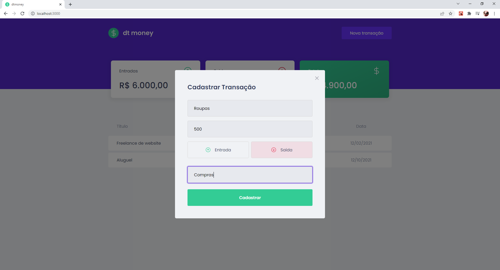
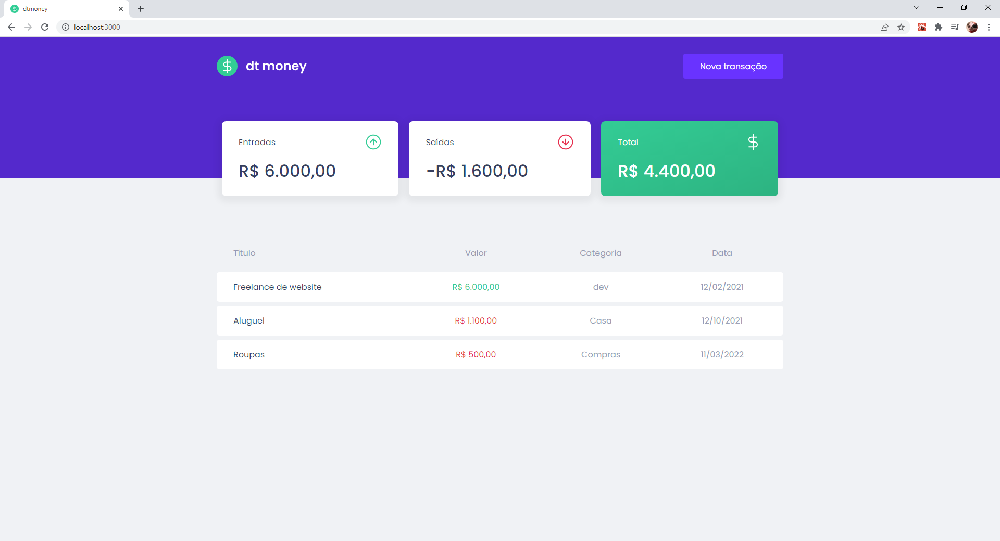

# dt money
Controle de finanças pessoais.

Projeto referente ao Chapter II do curso de ReactJS da rocketseat.

## Utilidades

- Visualização do fluxo de transações.
- Criação de transações.

## 🛠 Ferramentas 

- Typescript
- ReactJS
- Styled Components
- MirageJS
- Context API
- Axios

## Screenshots

